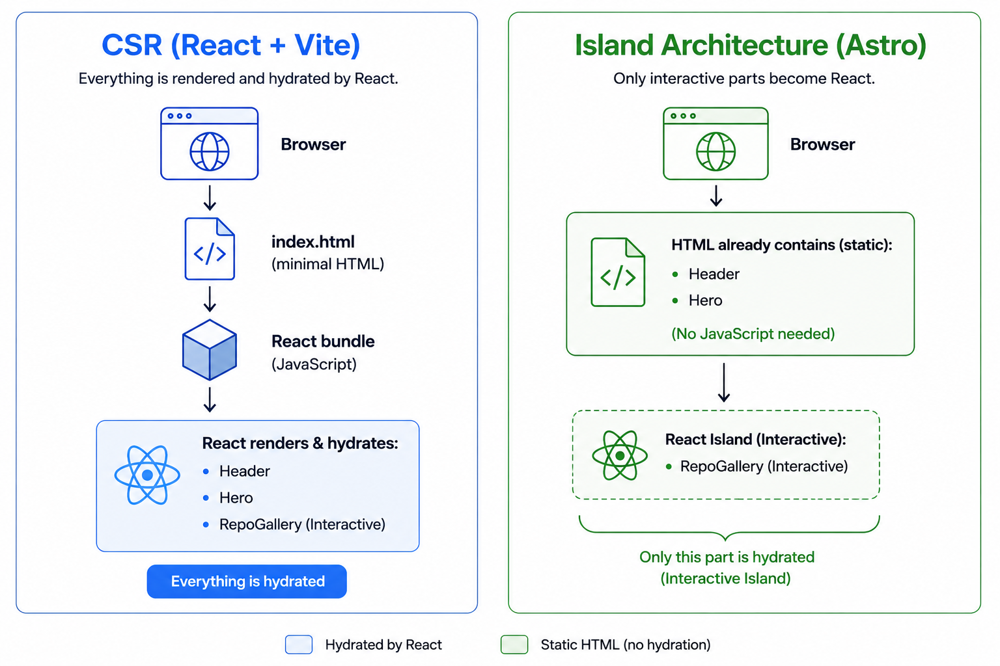

# CSR vs Island Architecture

A side-by-side comparison of Traditional Client-Side Rendering (React) vs Island Architecture (Astro).

## Projects

| Project | Approach | Run |
|---|---|---|
| `csr-react` | Traditional CSR (React + Vite) | `cd csr-react && npm run dev` |
| `island-architecture-astro` | Island Architecture (Astro + React) | `cd island-architecture-astro && npm run dev` |

## What is CSR?

Client-Side Rendering sends an empty HTML shell. The browser downloads and executes **all** JavaScript before rendering anything. Every component — even static ones like a Header or Hero — ships React code that does nothing useful.

**The problem:** 100% of your JS is a single required download, regardless of how much of it the user actually needs.

## What is Island Architecture?

Astro pre-renders every component into static HTML. Only interactive components ("islands") ship JavaScript, and they hydrate on demand using directives like `client:visible` (hydrates when scrolled into view) or `client:idle` (hydrates when the browser is idle).

**The benefit:** Static content is instant. JS is loaded only for what truly needs it.

## Results

Both projects have identical UI (Header, Hero, interactive repo gallery), but the JS footprint is dramatically different:

| Metric | CSR (React) | Island Architecture (Astro) |
|---|---|---|
| **JS shipped** | 195 KB (61 KB gzipped) | 0 KB initial |
| **Static components** | Ship unnecessary JS | Pure HTML — zero JS |
| **Interactive gallery** | Loaded with everything else | 1.4 KB + React runtime, loaded only on scroll |
| **Time to interactive** | Blocked on full JS download | Instant for static content |

## The Code

- **`csr-react/`** — Standard React SPA. `App.tsx` renders Header, Hero, and RepoGallery. All components are React, all are bundled together by Vite, all ship to the client.
- **`island-architecture-astro/`** — Astro project. Header and Hero are `.astro` components (zero JS). RepoGallery is a React component wrapped with `client:visible` — it only hydrates when the user scrolls to it.

## Presentation

See [`presentation.md`](presentation.md) for slide-ready notes.
